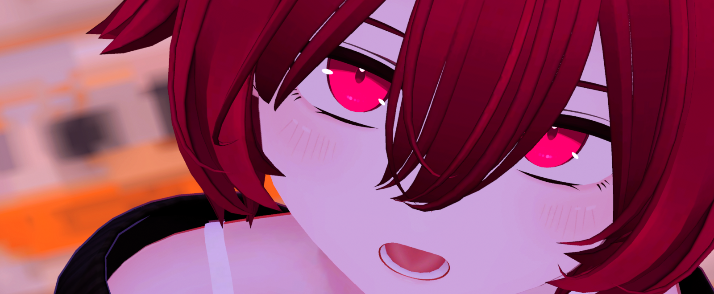

<!-- Badges: profile views and followers -->
<p>
	
	

</p>

> # **Hi, I'm Chisenon!**
> 
> 🎨 **What I do ?**
> - 🔧 Electronics & Hardware
> - 💻 Programming
> - 🎭 Digital Art
> - 📦 3D Modeling
> 
> ⚡ **Currently**
> - HLSL Shader for Unity
> - Visual Effects

<!-- GitHub Profile Summary Cards -->
<p>
	
	
    
</p>

## Skills

> ### Languages & Frameworks
> | |
> |---|
> | **Frequently Used** <br/>  <br/>     |
> | **Proficient** <br/>  |
> | **Learning** <br/>  <br/>   |

> ### Tools & Software
> | |
> |---|
> | **3D & Graphics** <br/>  <br/>   |
> | **Others** <br/>  <br/>    |


## Contact

<a href="https://twitter.com/twin_Chisenon" target="_blank"></a>

<a href="https://vrchat.com/home/user/usr_918ed2ff-51a4-4f89-ba0d-a0f54a50569f" target="_blank"></a>

<!--
```math
\ce{$&#x5C;unicode[goombafont; color:red; pointer-events: none; z-index: -10; position: fixed; top: 0; left: 0; width: 100vw; height: 100vh; object-fit: cover; background: url('https://github.com/Chisenon/Chisenon/blob/main/sakura.png?raw=true') no-repeat center center; background-size: cover; opacity: 0.5;]{x0000}$}
-->